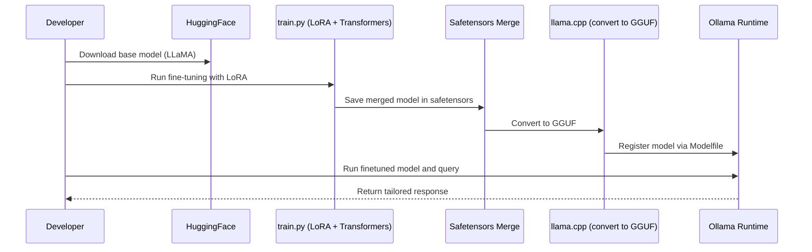

# LLaMA Fine-tuning with Transformers, Safetensors, and Ollama

This project demonstrates how to fine-tune a Qwen model using Hugging Face Transformers with LoRA
adapters, save the merged model in **safetensors** format, and then run it locally with **Ollama**.

## 🎯 Overview

This guide shows how to **finetune a LLaMA model using Hugging Face Transformers + PEFT**, save in *
*safetensors**, merge adapters, convert to **GGUF** with `llama.cpp`, and finally run the model
inside **Ollama**.

✅ **Includes:**

- Conda environment setup
- Finetuning with LoRA adapters
- Saving & merging weights (safetensors)
- Converting to GGUF
- Deploying in Ollama
- Testing and verifying finetuned behavior

## 📦 Project Structure

```
llama-finetune-project/
├── train.py          # Fine-tuning script with LoRA + safetensors merge
├── Makefile          # Build automation (train, convert, Ollama create/run)
├── Modelfile         # Ollama configuration for the finetuned model
├── environment.yml   # Conda environment specification
├── Dockerfile        # Containerized runtime (optional)
└── README.md         # Documentation (this file)
```

## 🚀 Quick Start

### 1. Environment Setup

Create and activate the conda environment:

```bash
conda env create -f environment.yml
conda activate llama-finetune
```

**Environment Configuration (`environment.yml`):**

```yaml
name: llama-finetune
channels:
  - conda-forge
  - defaults
dependencies:
  - python=3.10
  - pip
  - pip:
      - torch>=2.2.0
      - transformers>=4.44.0
      - datasets
      - accelerate
      - peft
      - safetensors
      - sentencepiece
# Optional (Linux/NVIDIA only):
#      - bitsandbytes
```

### 2. Hugging Face Authentication

You need a Hugging Face account with access to LLaMA 2:

```bash
huggingface-cli login
```

### 3. Run the Complete Pipeline

```bash
# Train, convert, create Ollama model, and run it in one go:
make all

# Or run individual steps:
make train          # Fine-tune and merge LoRA adapters
make convert        # Convert to GGUF format
make ollama-create  # Create Ollama model
make ollama-run     # Test the model
```

## 🔧 Detailed Workflow

### Step 1: Base Model Loading

The training script uses the Qwen base model from Hugging Face:

```python
from transformers import AutoModelForCausalLM, AutoTokenizer

model_name = "unsloth/Qwen3-4B-Instruct-2507"
tokenizer = AutoTokenizer.from_pretrained(model_name, trust_remote_code=True)
model = AutoModelForCausalLM.from_pretrained(
  model_name,
  torch_dtype="auto",
  device_map="auto"
)
```

### Step 2: Training Data Format

Example training data for a customer support assistant:

```python
train_data = [
  {
    "instruction": "What's the return policy?",
    "response": "You can return items within 30 days for a full refund."
  },
  {
    "instruction": "Do you ship internationally?",
    "response": "Yes, we ship worldwide with an extra fee depending on location."
  },
  {
    "instruction": "How can I reset my password?",
    "response": "Go to your account settings, click 'Reset Password', and follow the instructions sent to your email."
  }
]
```

### Step 3: LoRA Configuration

Parameter-efficient fine-tuning using LoRA:

```python
from peft import LoraConfig, get_peft_model, TaskType

lora_config = LoraConfig(
  task_type=TaskType.CAUSAL_LM,
  r=8,
  lora_alpha=32,
  lora_dropout=0.05,
  target_modules=["q_proj", "v_proj"]
)
model = get_peft_model(model, lora_config)
```

### Step 4: Training Configuration

```python
from transformers import TrainingArguments, Trainer

training_args = TrainingArguments(
  output_dir="./finetuned-qwen",
  per_device_train_batch_size=2,
  gradient_accumulation_steps=4,
  learning_rate=2e-4,
  num_train_epochs=3,
  fp16=True,
  save_strategy="epoch",
  save_total_limit=2,
  logging_dir="./logs"
)
```

### Step 5: Safetensors Integration

The training process automatically saves checkpoints in safetensors format:

```python
trainer.save_model("./finetuned-qwen-sft")  # Saves adapter_model.safetensors
```

### Step 6: LoRA Adapter Merging

Merge LoRA adapters back into the base model:

```python
from peft import AutoPeftModelForCausalLM

model = AutoPeftModelForCausalLM.from_pretrained(
  "./finetuned-qwen-sft",
  torch_dtype="auto",
  device_map="auto"
)
merged_model = model.merge_and_unload()
merged_model.save_pretrained("./finetuned-qwen-merged", safe_serialization=True)
```

### Step 7: GGUF Conversion

Convert the merged safetensors model to GGUF format for Ollama:

```bash
git clone https://github.com/ggerganov/llama.cpp
cd llama.cpp
pip install -r requirements.txt
python3 convert.py ./finetuned-qwen-merged --outtype q4_K_M
```

### Step 8: Ollama Deployment

**Modelfile Configuration (tool and streaming friendly):**

```
FROM ./finetuned-qwen-merged.Q4_K_M.gguf

# Keep outputs tool-call friendly; avoid custom stop markers that truncate JSON
PARAMETER temperature 0.2
PARAMETER top_p 0.9
# PARAMETER stop "###"  # Do not force generic stop strings

# Minimal template so Ollama can inject Tools/messages correctly
TEMPLATE """
{{- if .Tools }}
You are a helpful AI assistant that can call tools. When you need to use a tool, reply with a JSON object with keys: "tool_name" and "tool_arguments" only. Do not include extra text.
{{ end -}}
{{ .System }}
{{ .Prompt }}
"""
```

**Deploy to Ollama:**

```bash
ollama create finetuned-qwen -f Modelfile
ollama run finetuned-qwen
```

## 🧪 Testing the Finetuned Model

### Example Interaction

**Input:**

```
What's the return policy?
```

**Expected Output (after fine-tuning):**

```
You can return items within 30 days for a full refund.
```

### Pre-deployment Testing

Before converting to Ollama, you can test the model with Hugging Face:

```python
from transformers import pipeline

messages = [
  {"role": "system", "content": "You are an AI assistant that can call tools."},
  {"role": "user", "content": "What's the return policy?"}
]
prompt = tokenizer.apply_chat_template(messages, tokenize=False, add_generation_prompt=True)
pipe = pipeline("text-generation", model="./finetuned-qwen-merged", tokenizer=tokenizer)
out = pipe(prompt, max_new_tokens=50)
print(out[0]["generated_text"])
```

## 📊 Process Visualization



## 🔄 Makefile Commands

The included Makefile automates the entire workflow:

```makefile
# Configuration
PYTHON=python
BASE_MODEL=unsloth/Qwen3-4B-Instruct-2507
MERGED_DIR=./finetuned-qwen-merged
GGUF_MODEL=finetuned-qwen-merged.Q4_K_M.gguf
OLLAMA_MODEL=finetuned-qwen

# Available commands:
make train          # Train and merge LoRA into safetensors
make convert        # Convert to GGUF using llama.cpp
make ollama-create  # Create Ollama model
make ollama-run     # Run Ollama model
make all           # Run everything in order
```

## 🐳 Docker Support

Optional containerized environment:

```dockerfile
FROM python:3.10-slim

WORKDIR /app
COPY requirements.txt .
RUN pip install -r requirements.txt

COPY . .
CMD ["python", "train.py"]
```

## 🔑 Key Technologies & Best Practices

### Transformers Library

- **Standardized APIs** for model loading, tokenization, training, and inference
- **Trainer/Accelerator utilities** for distributed training, mixed precision, and checkpointing
- **Consistency** across model families (BERT, GPT, LLaMA, etc.)
- **Integration** with datasets and logging tools for reproducibility

### Safetensors Format

- **Security**: Cannot execute arbitrary code on load (unlike pickle-based formats)
- **Performance**: Faster and more memory-efficient loading
- **Reproducibility**: Deterministic storage format for reliable sharing
- **Zero-copy**: Memory-mapped access for efficient loading

### PEFT (Parameter-Efficient Fine-Tuning)

- **LoRA adapters** reduce memory requirements and training time
- **Modular approach** allows easy merging and deployment
- **Cost-effective** fine-tuning for large models

## ⚠️ Important Notes

- **Prerequisites**: Make sure Ollama is already running as a service before `make ollama-run`
- **GPU/Memory**: Large models may require significant memory. On Apple Silicon, consider starting
  with a smaller model like `sshleifer/tiny-gpt2` or `meta-llama/Llama-2-7b-hf` with reduced seq
  length and batch size.
- **Model Access**: LLaMA models require accepting Meta's license agreement on Hugging Face
- **Customization**: You can tweak LoRA parameters (rank, alpha, dropout) in `train.py`

## 🎛️ Configuration Options

### Training Parameters

- `EPOCHS = 3` - Number of training epochs
- `LR = 2e-4` - Learning rate
- `BATCH_SIZE = 2` - Training batch size
- `MAX_LEN = 512` - Maximum sequence length

### LoRA Parameters

- `r=8` - LoRA rank (higher = more parameters)
- `lora_alpha=32` - LoRA scaling parameter
- `lora_dropout=0.05` - Dropout rate for LoRA layers
- `target_modules=["q_proj", "v_proj"]` - Which layers to apply LoRA to

## 🍏 Apple Silicon (M1/M2/M3) Notes

- bitsandbytes does not support Apple Silicon GPUs. Do not install it; our environment.yml omits it
  by default.
- Use PyTorch with MPS backend (comes with official wheels). Ensure: python -c "import torch; print(
  torch.backends.mps.is_available())" prints True.
- Run training with: make train PYTHON="python" or explicitly: python train.py --device mps
  --precision bf16
- If you already installed bitsandbytes earlier, remove it: pip uninstall -y bitsandbytes
- If you see 'NoneType has no attribute cadam32bit_grad_fp32' it means bitsandbytes was imported on
  a non-CUDA setup. Remove bitsandbytes from your environment and reinstall torch/transformers.
- For stability on MPS, bf16 is preferred. If you hit issues, fallback to --precision fp32.

## 🔍 Troubleshooting

### Common Issues

1. **CUDA out of memory**: Reduce batch size or use gradient checkpointing
2. **Model access denied**: Ensure you've accepted the LLaMA license on Hugging Face
3. **Conversion errors**: Make sure the merged model directory contains all required files
4. **Ollama connection**: Verify Ollama service is running with `ollama list`

### Performance Tips

- Use mixed precision training (`fp16=True`) to reduce memory usage
- Implement gradient accumulation for effective larger batch sizes
- Consider using smaller LoRA ranks for faster training

## 📚 Additional Resources

- [Hugging Face Transformers Documentation](https://huggingface.co/docs/transformers)
- [PEFT Library Documentation](https://huggingface.co/docs/peft)
- [Safetensors Format Specification](https://github.com/huggingface/safetensors)
- [Ollama Documentation](https://ollama.ai/docs)
- [llama.cpp Repository](https://github.com/ggerganov/llama.cpp)

## 🤝 Contributing

Feel free to submit issues, feature requests, or pull requests to improve this workflow.

## 📄 License

This project is provided as-is for educational and research purposes. Please respect the individual
licenses of the underlying models and libraries used.


## 🤝 Spring AI + Qwen Tool Integration

This project aligns the fine-tuned Qwen model with Spring AI’s ChatClient and tool-calling flow.

### Ollama Modelfile Template (Tools + Streaming)
We use a minimal template that keeps system prompts clean and ensures JSON-only tool calls. Avoid generic stop markers so streaming does not truncate JSON.

```
# Modelfile
FROM ./finetuned-qwen-merged.q8_0.gguf

# Streaming-friendly defaults; avoid truncating JSON tool calls
PARAMETER temperature 0.2
PARAMETER top_p 0.9
# Do not add generic stop markers (e.g., "###"). Rely on EOS so Spring AI can detect JSON boundaries.
# PARAMETER stop "###"  # intentionally not used

# Keep template minimal; let Ollama/Spring AI supply tools/messages.
TEMPLATE """
{{- if .Tools }}
You are an AI assistant that can call tools. To use a tool, output JSON with exactly "tool_name" and "tool_arguments".
Do not wrap JSON in natural language. Do not include additional text.
{{- end }}
{{ .System }}
{{ .Prompt }}
"""
```

Notes:
- Tool intention is expressed only when .Tools are present. The assistant’s natural language output remains clean otherwise.
- No custom stop sequences. Spring AI can stream and detect JSON boundaries by buffering until the closing brace.

### Training Setup (Qwen Chat Template + Tool Examples)
train.py now uses Qwen’s native chat template and trains only on assistant tokens:

- Tokenizer: `AutoTokenizer.from_pretrained(model_name, trust_remote_code=True)`
- Prompting: `tokenizer.apply_chat_template(messages, tokenize=False, add_generation_prompt=True)`
- Label masking: non‑assistant tokens are masked with -100 so loss applies to the assistant’s response only.
- Tool examples: included and optionally oversampled via `TOOL_OVERSAMPLE` (default 3) to reinforce JSON tool-call style.

Example tool training sample:

```json
{
  "instruction": "Calculate the sum of 5 and 7 and respond using the 'calculator' tool.",
  "response": "{\"tool_name\": \"calculator\", \"tool_arguments\": {\"a\": 5, \"b\": 7}}"
}
```

Sanity check after training (built into train.py):

```python
from transformers import pipeline

messages = [
  {"role": "system", "content": "You are an AI assistant that can call tools."},
  {"role": "user", "content": "Calculate 5 plus 7 using the calculator tool."}
]
prompt = tokenizer.apply_chat_template(messages, tokenize=False, add_generation_prompt=True)
pipe = pipeline("text-generation", model="./finetuned-qwen-merged", tokenizer=tokenizer)
print(pipe(prompt, max_new_tokens=100)[0]["generated_text"])
```

If you see a clean JSON object, Spring AI will parse it and call your tool.

### Spring AI Integration Tips
- Use ChatClient with messages containing `system`, `user`, and `assistant` roles. Qwen’s tokenizer expects these roles.
- Define tools with `@Tool` and have handlers accept the JSON structure: `{ "tool_name": string, "tool_arguments": object }`.
- When streaming (`@Streaming` or streaming ChatClient), buffer output until a complete JSON object is received (e.g., first `{` to matching `}`) before parsing.
- After tool execution, feed the tool result back into the conversation and continue the assistant response normally.

Example expected tool call from the model:

```json
{"tool_name":"weather","tool_arguments":{"location":"Stockholm"}}
```

### Version Notes
- transformers >= 4.44.0 (matches environment.yml)
- We rely on Qwen tokenizer’s native chat template; do not inject custom prompt formats in training or inference.
