# Qwen (LLaMA-style) Fine-tuning with Transformers, Safetensors, and Ollama

This project demonstrates how to fine-tune a Qwen (LLaMA-style) model using Hugging Face Transformers with LoRA
adapters, save the merged model in **safetensors** format, and then run it locally with **Ollama**.

## 🎯 Overview

This guide shows how to finetune a Qwen (LLaMA-style) model using Hugging Face Transformers + PEFT, save in safetensors, merge adapters, convert to GGUF with `llama.cpp`, and finally run the model inside Ollama.

✅ **Includes:**

- Conda environment setup
- Finetuning with LoRA adapters
- Saving & merging weights (safetensors)
- Converting to GGUF
- Deploying in Ollama
- Testing and verifying finetuned behavior

## 📦 Project Structure

```
llama-finetune-project/
├── train.py          # Fine-tuning script with LoRA + safetensors merge
├── Makefile          # Build automation (train, convert, Ollama create/run)
├── Modelfile         # Ollama configuration for the finetuned model
├── environment.yml   # Conda environment specification
├── Dockerfile        # Containerized runtime (optional)
└── README.md         # Documentation (this file)
```

## 🚀 Quick Start

### 1. Environment Setup

Create and activate the conda environment:

```bash
conda env create -f environment.yml
conda activate llama-finetune
```

**Environment Configuration (`environment.yml`):**

```yaml
name: llama-finetune
channels:
  - conda-forge
  - defaults
dependencies:
  - python=3.10
  - pip
  - pip:
      - torch>=2.2.0
      - transformers>=4.41.0
      - datasets
      - accelerate
      - peft
      - safetensors
      - sentencepiece
# Optional (Linux/NVIDIA only):
#      - bitsandbytes
```

### 2. Hugging Face Authentication

You need a Hugging Face account (no special access required for the Qwen base used here):

```bash
huggingface-cli login
```

### 3. Prepare Dataset and Run the Complete Pipeline

```bash
# Prepare dataset (parses README.md and synthesizes Q/A), then run all steps:
make all

# Or run individual steps:
make prepare                    # Produce dataset.txt (JSONL with {instruction,response})
make train DATASET=dataset.txt  # Fine-tune and merge LoRA adapters
make convert                    # Convert to GGUF format
make ollama-create              # Create Ollama model
make ollama-run                 # Test the model
```

## 🔧 Detailed Workflow

### Step 1: Base Model Loading (Qwen3-4B-Instruct)

The training script loads Qwen3-4B-Instruct from Hugging Face:

```python
from transformers import AutoModelForCausalLM, AutoTokenizer

model_name = "unsloth/Qwen3-4B-Instruct-2507"
tokenizer = AutoTokenizer.from_pretrained(model_name)
model = AutoModelForCausalLM.from_pretrained(
  model_name,
  torch_dtype="auto",
  device_map="auto"
)
```

### Step 2: Training Data Format (Prepared by prepare.py)

Example training data for a customer support assistant:

```python
# prepare.py parses this code block from README.md and synthesizes additional Q/A
# to build the fine-tuning dataset. Keep key names exactly as below.
train_data = [
  {
    "instruction": "What's the return policy?",
    "response": "You can return items within 30 days for a full refund."
  },
  {
    "instruction": "Do you ship internationally?",
    "response": "Yes, we ship worldwide with an extra fee depending on location."
  },
  {
    "instruction": "How can I reset my password?",
    "response": "Go to your account settings, click 'Reset Password', and follow the instructions sent to your email."
  }
]
```

### Step 3: LoRA Configuration

Parameter-efficient fine-tuning using LoRA:

```python
from peft import LoraConfig, get_peft_model, TaskType

lora_config = LoraConfig(
  task_type=TaskType.CAUSAL_LM,
  r=8,
  lora_alpha=32,
  lora_dropout=0.05,
  target_modules=["q_proj", "v_proj"]
)
model = get_peft_model(model, lora_config)
```

### Step 4: Training Configuration

train.py contains the training configuration. Key effective values in this repo:
- OUTPUT_DIR: ./finetuned-qwen-masked
- MERGED_DIR: ./finetuned-qwen-masked-merged
- EPOCHS: 10
- LR: 5e-5
- BATCH_SIZE: 1
- MAX_LEN: 128
- Prompt-label masking: prompt tokens are masked out (-100) so only the response is learned.
- Eval split: a minimal eval set is created to enable eval per epoch and early stopping.
- Callbacks: EarlyStoppingCallback on eval loss (threshold=0.1, patience=2) and GradNormEarlyStopCallback (min_improvement=0.001, patience=1).

### Step 5: Safetensors Integration

The training process automatically saves LoRA adapter checkpoints in safetensors format to OUTPUT_DIR (./finetuned-qwen-masked).

### Step 6: LoRA Adapter Merging

Merge LoRA adapters back into the base model:

```python
from peft import AutoPeftModelForCausalLM

model = AutoPeftModelForCausalLM.from_pretrained(
  "./finetuned-qwen-masked",
  torch_dtype="auto",
  device_map="auto"
)
merged_model = model.merge_and_unload()
merged_model.save_pretrained("./finetuned-qwen-masked-merged", safe_serialization=True)
```

### Step 7: GGUF Conversion

Convert the merged safetensors model to GGUF format for Ollama:

```bash
# You can use the provided Makefile target instead:
make convert QTYPE=q8_0

# Or run llama.cpp converter manually (examples; the exact script name may vary by commit):
cd llama.cpp
python3 convert-hf-to-gguf.py --outfile ../finetuned-qwen-merged.q8_0.gguf --outtype q8_0 ../finetuned-qwen-masked-merged
# or
python3 tools/convert-hf-to-gguf.py --outfile ../finetuned-qwen-merged.q8_0.gguf --outtype q8_0 ../finetuned-qwen-masked-merged
```

### Step 8: Ollama Deployment

**Modelfile Configuration:**

```
FROM ./finetuned-qwen-merged.q8_0.gguf

PARAMETER temperature 0.2
PARAMETER stop "###"

TEMPLATE """
### Instruction:
{{ .Prompt }}

### Response:
"""
```

**Deploy to Ollama:**

```bash
ollama create finetuned-qwen -f Modelfile
ollama run finetuned-qwen
```

## 🧪 Testing the Finetuned Model

### How the dataset is prepared and used
- Run `make prepare` (or `python prepare.py`) to parse this README for a Python code block that defines `train_data = [...]` and to synthesize meta Q/A from the README structure (title and section headers) and Makefile.
- The output is a JSON Lines file (default: `dataset.txt`) where each line contains `{ "instruction": ..., "response": ... }`.
- Then run `make train DATASET=dataset.txt` (or `python train.py --dataset dataset.txt`). If `--dataset` is omitted, train.py will fall back to its internal README parsing for backward compatibility, but the recommended path is to use prepare.py.

### Early Stopping by Gradient Norm
- A custom `GradNormEarlyStopCallback` stops training when the average gradient norm improvement per epoch is below a threshold.
- Defaults in this repo: min_improvement=0.001, patience=1. Combined with Transformers `EarlyStoppingCallback` on eval_loss (threshold=0.1, patience=2).

### Example Interaction

**Input:**

```
What's the return policy?
```

**Expected Output (after fine-tuning):**

```
You can return items within 30 days for a full refund.
```

### Pre-deployment Testing

Before converting to Ollama, you can test the model with Hugging Face:

```python
from transformers import pipeline

pipe = pipeline("text-generation", model="./finetuned-qwen-masked-merged")
out = pipe("### Instruction:\nWhat's the return policy?\n\n### Response:", max_new_tokens=50)
print(out[0]["generated_text"])
```

## 📊 Process Visualization

```mermaid
sequenceDiagram
    participant Dev as Developer
    participant Env as Conda Env
    participant Make as Makefile
    participant Prep as prepare.py (Dataset Prep)
    participant FS as File system
    participant HF as HuggingFace
    participant Train as train.py (LoRA + merge)
    participant LCPP as llama.cpp (convert to GGUF)
    participant Ollama as Ollama Runtime

    Dev ->> Env: conda activate llama-finetune
    Env -->> Dev: <conda shell>
    Dev ->> Env: make all
    Env -->> Make: make all
    Make ->> Prep: prepare
    Prep -->> FS: write dataset.txt (JSONL)
    Make -->> HF: download base model (Qwen3-4B-Instruct)
    Make ->> Train: train (dataset.txt, LoRA fine-tune + save + merge)
    Train -->> FS: load dataset.txt
    Train -->> FS: finetuned-qwen-masked (adapters) + finetuned-qwen-masked-merged (safetensors)
    Make ->> LCPP: convert (QTYPE=q8_0)
    LCPP -->> FS: finetuned-qwen-merged.q8_0.gguf
    Make ->> Ollama: create (Modelfile)
    Ollama -->> FS: register finetuned-qwen:latest
    Dev ->> Ollama: 'ollama run finetuned-qwen:latest' (optional)
    Ollama -->> Dev: interactive responses

    Note over Dev,Make: make all orchestrates prepare → train → convert → ollama-create → ollama-run
```



Note: In this workflow, the developer typically only activates the Conda environment and runs `make all`. All intermediate artifacts are written to the local file system by the respective tools. You can later run the model manually from the command line with:

```bash
dev$ ollama run finetuned-qwen:latest
```

## 🔄 Makefile Commands

The included Makefile automates the entire workflow:

```makefile
# Configuration (see Makefile in repo for the authoritative values)
PYTHON=python
MERGED_DIR=./finetuned-qwen-masked-merged
QTYPE?=q8_0
GGUF_MODEL=finetuned-qwen-merged.$(QTYPE).gguf
OLLAMA_MODEL=finetuned-qwen

# Available commands:
# make prepare                     # Generate dataset.txt (JSONL)
# make train DATASET=dataset.txt   # Fine-tune and merge LoRA adapters
# make convert                     # Convert to GGUF using llama.cpp
# make ollama-create               # Create Ollama model
# make ollama-run                  # Run Ollama model
# make all                         # Prepare + train + convert + create + run
```

## 🐳 Docker Support

Optional containerized environment:

```dockerfile
FROM python:3.10-slim

WORKDIR /app
COPY requirements.txt .
RUN pip install -r requirements.txt

COPY . .
CMD ["python", "train.py"]
```

## 🔑 Key Technologies & Best Practices

### Transformers Library

- **Standardized APIs** for model loading, tokenization, training, and inference
- **Trainer/Accelerator utilities** for distributed training, mixed precision, and checkpointing
- **Consistency** across model families (BERT, GPT, LLaMA, etc.)
- **Integration** with datasets and logging tools for reproducibility

### Safetensors Format

- **Security**: Cannot execute arbitrary code on load (unlike pickle-based formats)
- **Performance**: Faster and more memory-efficient loading
- **Reproducibility**: Deterministic storage format for reliable sharing
- **Zero-copy**: Memory-mapped access for efficient loading

### PEFT (Parameter-Efficient Fine-Tuning)

- **LoRA adapters** reduce memory requirements and training time
- **Modular approach** allows easy merging and deployment
- **Cost-effective** fine-tuning for large models

## ⚠️ Important Notes

- **Prerequisites**: Make sure Ollama is already running as a service before `make ollama-run`
- **GPU/Memory**: Large models may require significant memory. On Apple Silicon, consider starting
  with a smaller model like `sshleifer/tiny-gpt2` or `meta-llama/Llama-2-7b-hf` with reduced seq
  length and batch size.
- **Model Access**: Some models require accepting specific licenses on Hugging Face; Qwen3-4B-Instruct (unsloth variant) is publicly accessible.
- **Customization**: You can tweak LoRA parameters (rank, alpha, dropout) in `train.py`

## 🎛️ Configuration Options

### Important Paths and Outputs
- OUTPUT_DIR: ./finetuned-qwen-masked
- MERGED_DIR: ./finetuned-qwen-masked-merged
- After training, train.py also runs a quick generation test with one of the README-derived instructions and an abstract README question.

### Data Handling
- DUPLICATES: the number of times parsed training examples are repeated to strengthen signal on tiny datasets (default 10).
- MAX_LEN: shared between prepare.py and train.py via Makefile (MAX_LEN?=128). Makefile passes MAX_LEN to both scripts; you can override with e.g. `make all MAX_LEN=256`.
- Chunking: prepare.py splits long instructions and especially long responses into multiple chunks guided by MAX_LEN, appending simple part markers (e.g., "[Response part 2/3]") so the model can learn to produce complete multi-part outputs for long, structured answers (like outlines) without being truncated.

### Training Parameters

- `EPOCHS = 10` - Number of training epochs (see train.py)
- `LR = 5e-5` - Learning rate
- `BATCH_SIZE = 1` - Training batch size
- `MAX_LEN = 128` - Maximum sequence length

### LoRA Parameters

- `r=8` - LoRA rank (higher = more parameters)
- `lora_alpha=32` - LoRA scaling parameter
- `lora_dropout=0.05` - Dropout rate for LoRA layers
- `target_modules=["q_proj", "v_proj"]` - Which layers to apply LoRA to

## 🍏 Apple Silicon (M1/M2/M3) Notes

- bitsandbytes does not support Apple Silicon GPUs. Do not install it; our environment.yml omits it
  by default.
- Use PyTorch with MPS backend (comes with official wheels). Ensure: python -c "import torch; print( torch.backends.mps.is_available())" prints True.
- You can simply run `make train` and the script will auto-detect MPS. The example flags `--device`/`--precision` are optional and ignored by the script, but harmless if present via the Makefile.
- If you already installed bitsandbytes earlier, remove it: pip uninstall -y bitsandbytes
- If you see 'NoneType has no attribute cadam32bit_grad_fp32' it means bitsandbytes was imported on
  a non-CUDA setup. Remove bitsandbytes from your environment and reinstall torch/transformers.
- For stability on MPS, bf16 is preferred. If you hit issues, fallback to --precision fp32.

## 🔍 Troubleshooting

### Common Issues

1. **CUDA out of memory**: Reduce batch size or use gradient checkpointing
2. **Model access denied**: Ensure you've accepted the LLaMA license on Hugging Face
3. **Conversion errors**: Make sure the merged model directory contains all required files
4. **Ollama connection**: Verify Ollama service is running with `ollama list`

### Performance Tips

- Use mixed precision training (`fp16=True`) to reduce memory usage
- Implement gradient accumulation for effective larger batch sizes
- Consider using smaller LoRA ranks for faster training

## 📚 Additional Resources

- [Hugging Face Transformers Documentation](https://huggingface.co/docs/transformers)
- [PEFT Library Documentation](https://huggingface.co/docs/peft)
- [Safetensors Format Specification](https://github.com/huggingface/safetensors)
- [Ollama Documentation](https://ollama.ai/docs)
- [llama.cpp Repository](https://github.com/ggerganov/llama.cpp)

## 🤝 Contributing

Feel free to submit issues, feature requests, or pull requests to improve this workflow.

## 📄 License

This project is provided as-is for educational and research purposes. Please respect the individual
licenses of the underlying models and libraries used.
